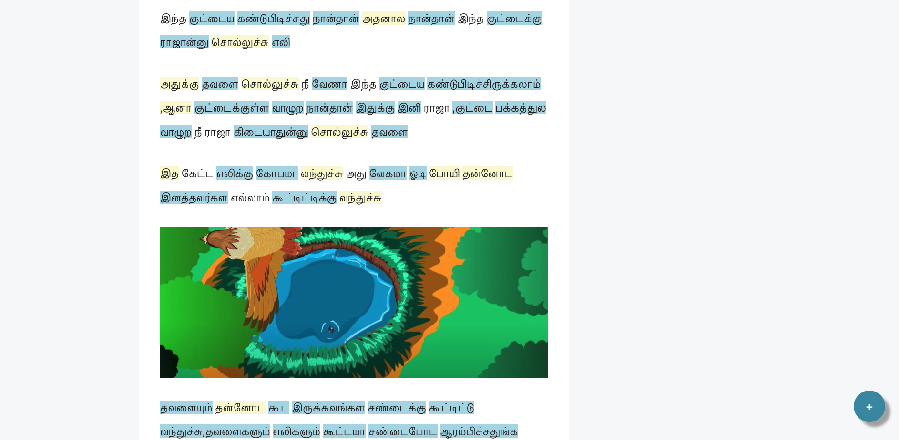
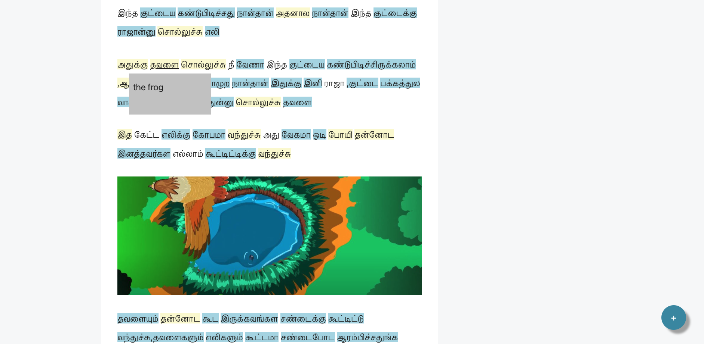

<div id="top"></div>
<!--
*** Using Best-README-Template from https://github.com/othneildrew/Best-README-Template
-->


<!-- PROJECT LOGO -->
<br />
<div align="center">
  <a href="https://github.com/ramyarajasekaran/Tamil-Reader">
    
  </a>

<h3 align="center">Tamil Reader</h3>

  <p align="center">
    LingQ for Tamil
    <br />
  </p>
</div>


<!-- TABLE OF CONTENTS -->
<details>
  <summary>Table of Contents</summary>
  <ol>
    <li>
      <a href="#about-the-project">About The Project</a>
      <ul>
        <li><a href="#built-with">Built With</a></li>
      </ul>
    </li>
    <li>
      <a href="#getting-started">Getting Started</a>
      <ul>
        <li><a href="#installation">Installation</a></li>
      </ul>
    </li>
    <li><a href="#usage">Usage</a></li>
  </ol>
</details>


<!-- ABOUT THE PROJECT -->
## About The Project

<div style="text-align: center;">

</div>
<p align="right">(<a href="#top">back to top</a>)</p>


### Built With

* [![JQuery][JQuery.com]][JQuery-url]

<p align="right">(<a href="#top">back to top</a>)</p>


<!-- GETTING STARTED -->
## Getting Started

### Installation

1. Get the API Key and firebase config from Ramya
2. Clone the repo
   ```sh
   git clone https://github.com/ramyarajasekaran/Tamil-Reader.git
   ```
3. Enter your API key and firebaseConfig variable in `content_script.js`
   ```js
   const API_KEY = 'ENTER YOUR API_KEY';
   const firebaseConfig = {...get from Ramya...};
   ```
4. Drag and drop extension folder into `chrome://extensions/`

<p align="right">(<a href="#top">back to top</a>)</p>


<!-- USAGE EXAMPLES -->
## Usage


<div style="text-align: center;">

</img>
<h4>Read Tamil text</h4>
</div>

<div style="text-align: center;">

</img>
<h4>Lookup a word</h4>
</div>

### Highlight legend
All unknown (and new) words are highlighted in BLUE.

All known words are not highlighted.

All words seen before but not yet known are highlighted in YELLOW.

### Lookup a word
To see the meaning of a word, click on it. Meaning will be shown in a popup box.
You can click the same word for popup to disappear.

### Learn a word
Once you've learned a word, you can mark it as known by
1. Clicking word to show meaning
2. Hitting '+' button in the lower right corner
3. Close meaning box by clicking word again

### Where does Tamil Reader work?
Tamil Reader is currently configured to run on websites mentioned in `manifest.json`. If you would like to add another website, please do so in `manifest.json`.


<p align="right">(<a href="#top">back to top</a>)</p>

<!-- CONTACT -->
## Contact

Project Link: [https://github.com/ramyarajasekaran/Tamil-Reader](https://github.com/ramyarajasekaran/Tamil-Reader)

<p align="right">(<a href="#top">back to top</a>)</p>

<!-- MARKDOWN LINKS & IMAGES -->
<!-- https://www.markdownguide.org/basic-syntax/#reference-style-links -->
[contributors-shield]: https://img.shields.io/github/contributors/github_username/repo_name.svg?style=for-the-badge
[contributors-url]: https://github.com/github_username/repo_name/graphs/contributors
[forks-shield]: https://img.shields.io/github/forks/github_username/repo_name.svg?style=for-the-badge
[forks-url]: https://github.com/github_username/repo_name/network/members
[stars-shield]: https://img.shields.io/github/stars/github_username/repo_name.svg?style=for-the-badge
[stars-url]: https://github.com/github_username/repo_name/stargazers
[issues-shield]: https://img.shields.io/github/issues/github_username/repo_name.svg?style=for-the-badge
[issues-url]: https://github.com/github_username/repo_name/issues
[license-shield]: https://img.shields.io/github/license/github_username/repo_name.svg?style=for-the-badge
[license-url]: https://github.com/github_username/repo_name/blob/master/LICENSE.txt
[linkedin-shield]: https://img.shields.io/badge/-LinkedIn-black.svg?style=for-the-badge&logo=linkedin&colorB=555
[linkedin-url]: https://linkedin.com/in/linkedin_username
[product-screenshot]: images/logo.png
[Next.js]: https://img.shields.io/badge/next.js-000000?style=for-the-badge&logo=nextdotjs&logoColor=white
[Next-url]: https://nextjs.org/
[React.js]: https://img.shields.io/badge/React-20232A?style=for-the-badge&logo=react&logoColor=61DAFB
[React-url]: https://reactjs.org/
[Vue.js]: https://img.shields.io/badge/Vue.js-35495E?style=for-the-badge&logo=vuedotjs&logoColor=4FC08D
[Vue-url]: https://vuejs.org/
[Angular.io]: https://img.shields.io/badge/Angular-DD0031?style=for-the-badge&logo=angular&logoColor=white
[Angular-url]: https://angular.io/
[Svelte.dev]: https://img.shields.io/badge/Svelte-4A4A55?style=for-the-badge&logo=svelte&logoColor=FF3E00
[Svelte-url]: https://svelte.dev/
[Laravel.com]: https://img.shields.io/badge/Laravel-FF2D20?style=for-the-badge&logo=laravel&logoColor=white
[Laravel-url]: https://laravel.com
[Bootstrap.com]: https://img.shields.io/badge/Bootstrap-563D7C?style=for-the-badge&logo=bootstrap&logoColor=white
[Bootstrap-url]: https://getbootstrap.com
[JQuery.com]: https://img.shields.io/badge/jQuery-0769AD?style=for-the-badge&logo=jquery&logoColor=white
[JQuery-url]: https://jquery.com 